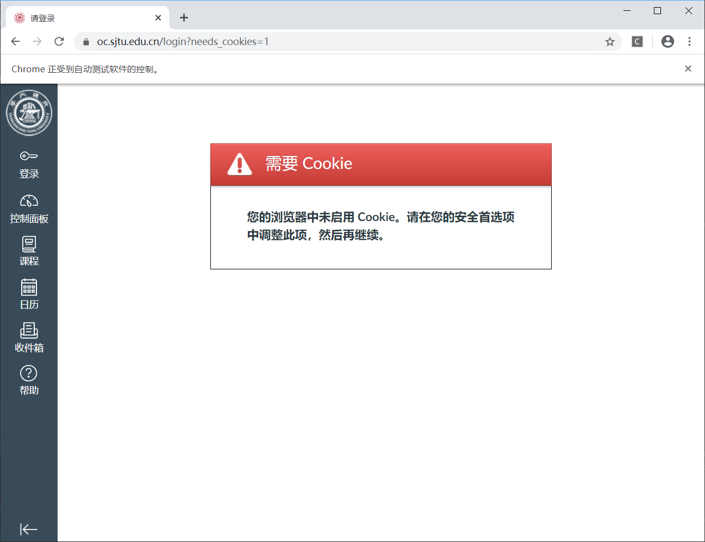
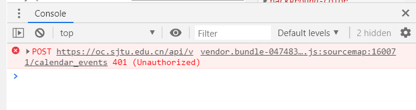
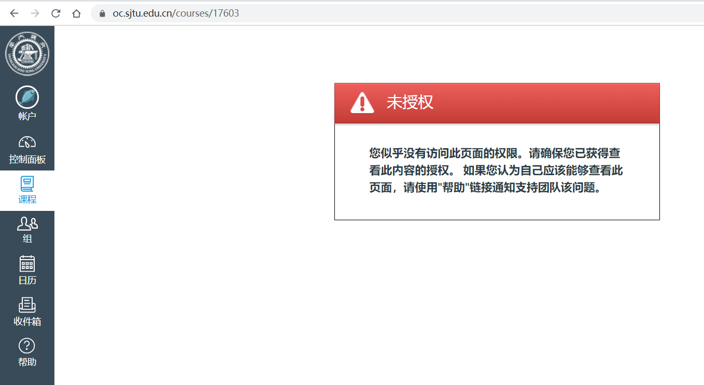
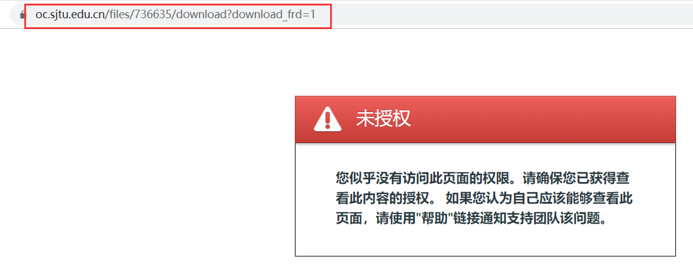
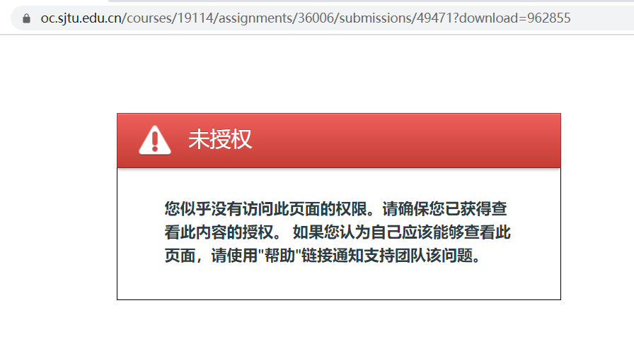

# 安全性测试

本测试不完全依赖Selenium，使用Chrome浏览器进行测试。

## Cookie

经过研究后，发现`oc.sjtu.edu.cn`的核心Cookie为`_normandy_session`。这个Cookie为一个加密串，服务器后端可以通过这个加密串获取用户信息，并对前端发送的请求做出正确的处理。
Cookie的正常工作测试主要分两个部分：

#### 1. 测试网页在删除Cookie后是否能正确跳转

在用户正常登录以后，删除名为`_normandy_session`的Cookie，再刷新页面，结果如下图：



可以发现，网页被重定向到了`oc.sjtu.edu.cn/login`这个登陆页面。

#### 2. 测试网页在删除Cookie后能否正常发送请求

测试采用了日历页面作为测试对象。

正常的创建事件流程如下：

1. 点击日历上的某处
2. 在弹出的输入框中编辑事件
3. 点击确定，完成事件创建

在第三步时，浏览器将通过 API `https://oc.sjtu.edu.cn/api/v1/calendar_events` 发送一个POST请求到后端，并完成事件的创建。

如果我们在第三步之前删除名为`_normandy_session`的Cookie进行测试，则在WebDriver的Log中，可以找到这次请求的返回代码为`401 Unauthorized`.

```java
// Get network logs on chrome.
for (LogEntry le : les) {
    if (le.toString().contains("https://oc.sjtu.edu.cn/api/v1/calendar_events") && le.toString().contains("\"Status\":\"401 Unauthorized\"")) {
        return true;
    }
}
```

在Selenium驱动的的Chrome中，也可以看到控制台报错：



因此，我们可以基本确定，**在Cookie失效或删除后，用户无法访问SJTU Canvas提供的服务。**

此外，**SJTU Canvas会在用户访问任何页面时重置除了**`_normandy_session`**的所有Cookie，刷新页面对Cookie没有影响。**

*该部分的代码位于`webuiTest\src\test\java\sjtu\testing\webui\SecurityTest.java`中。*

## 目录测试

目录测试同样分为两部分，用于测试两点：

#### 1. 用户能否通过目录的父目录获取这个目录下的所有内容（包括其他用户的内容）

在SJTU Canvas中，课程的url格式如下：
```
https://oc.sjtu.edu.cn/courses/<课程代号>
```
但是，用户直接访问`https://oc.sjtu.edu.cn/courses`界面的话，只能查看到自己的所有课程。

对小组（`https://oc.sjtu.edu.cn/groups`）的测试结果相同，亦只能查看到自己的所有小组。

#### 2. 用户能否通过猜测url，获取目录下的其他内容

如果用户随意猜测一个课程代号，即使该课程代号存在，用户的访问也会受到限制：



对于下载文件，canvas采用的并不是直链下载。

有两种用于下载的文件，一种是直接上传到课程页面的文件：

`https://oc.sjtu.edu.cn/files/736641/download?download_frd=1`

其中，`736641`为文件内部的ID。

如果我们更改ID去下载文件，仍然会跳转到如下页面：



第二种文件是自己提交的作业文件。这种文件的链接如下所示：

`https://oc.sjtu.edu.cn/courses/17606/assignments/39745/submissions/35855?download=1020733`

其中，`17606`为课程代号，`39745`为作业代号，`35855`为提交此作业的学生代号，download后为文件代号。

如果随意的更改学生代号和作业代号，那课程列表会提示找不到文件或当前学生不在此课程名单里。

**不过，如果不是这个提交者所提交的作业，但是这四个代号匹配，结果会如何呢？**

我让另一位同学发送了他文件下载的链接给我，结果如下：



依然无法下载。

**以上的测试证明，SJTU Canvas中无法通过猜测目录下的url，或直接访问目录等方法获取自己权限以外的文件。**