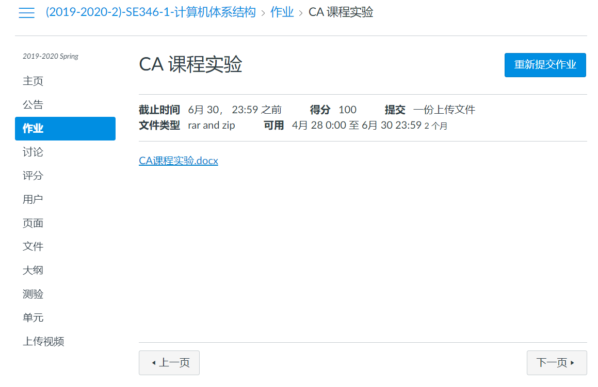
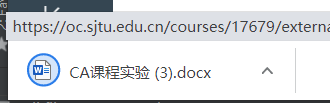
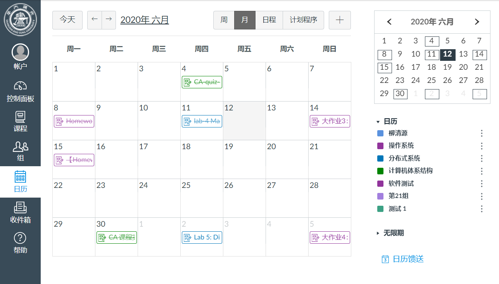
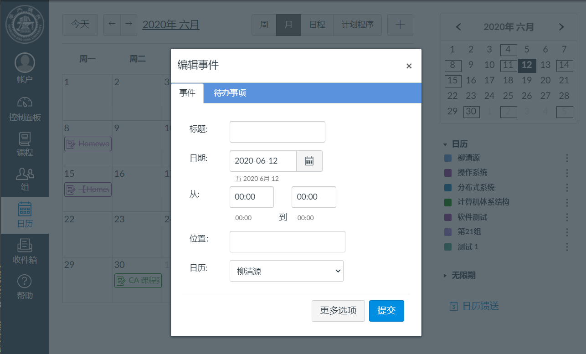
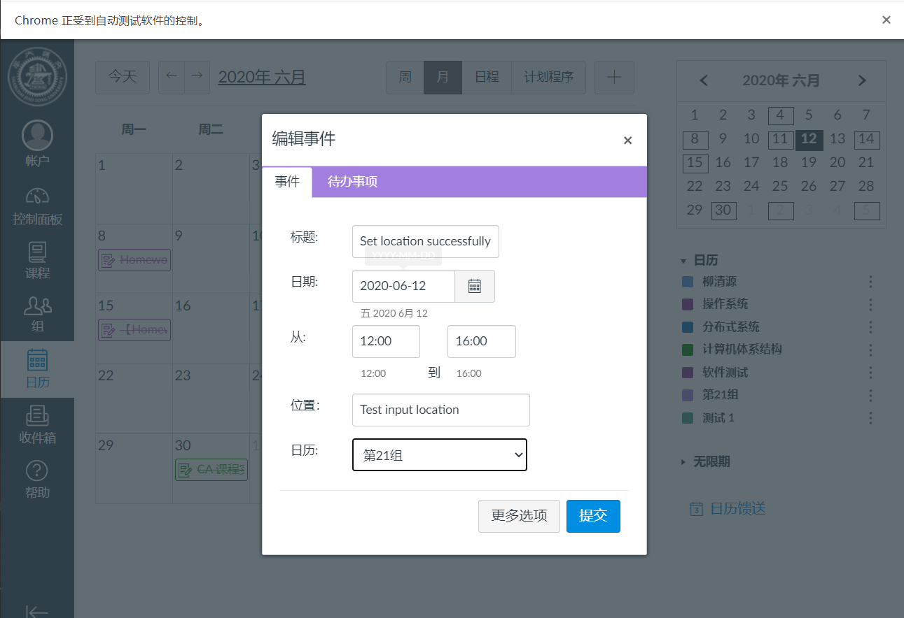
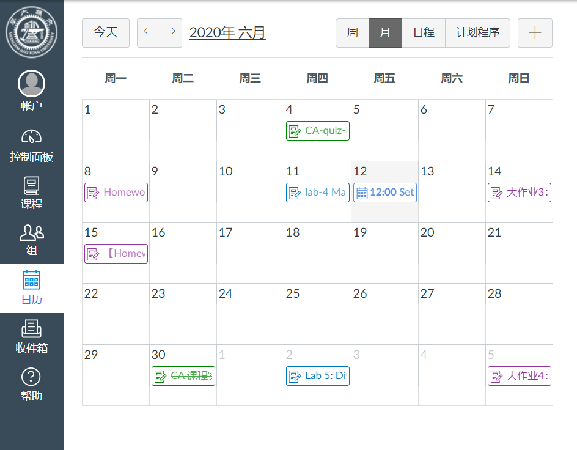

# 测试报告 

本测试报告由测试人员撰写，包含以下方面的内容
1. 测试依赖环境
2. 测试项目
    * 测试内容
    * 测试现象及截图
    * 测试结果分析与说明
----------------------------

## 测试依赖
软件名称| 开发厂商 |版本
--------|--------|---
Chrome 浏览器| Google | 83.0.4103.97（正式版本） （64 位）
chromedriver| Google | 83.0.4103.39 
Firefox浏览器 | Mozilla |77.0.1 (64-bit)
geckodriver | Mozilla | v0.26.0
Edge 浏览器 | Microsoft | 44.18362.449.0

## 功能测试
### 提交作业

#### 测试内容

本测试项目主要测试被测网站的提交作业的UI操作，包含**登录**、**选择课程**、**选择作业**、**提交作业**等一系列操作。

本测试项目主要涉及到的可交互 UI 元素如下：
* 输入框 —— 用于用户名、密码、验证码 等输入
* 按钮 —— 登录按钮、保存设置按钮等等
* 链接 —— 课程页面的路由链接
* 文件提交框 —— 提交作业组件

本次测试使用 
* java语言编写测试代码
* `Chrome浏览器` + `chromedriver` + `selenium` 自动化模拟 Web 环境
* Windows 10 平台

#### 测试现象及截图

1. 运行测试代码后，首先会运行对应的`chromedriver`；
2. 在driver启动之后，代码会启动chrome浏览器。浏览器启动后，会访问被测网站，由于被测网站需要登录后才能进行相应操作，因此可以看到浏览器页面被重定向到登录页面。下图展示的是登录页面

3. 代码会选择 **登录页面** 中的 蓝色区域，即**校内用户登录**
4. 页面跳转到`jaccount` 登陆界面，并自动识别验证码，填写用户指定的`jaccount`账户 和 对应的密码。

5. 在填写完用户名和密码以及验证码之后，登录成功则会进入我们的被测网站`Canvas`

6. 在主页左侧的导航栏选择 `课程`，弹出 我正在参加的所有课程列表 

7. 选择计算机体系结构，进入该课程。

8. 选择作业，选择`CA课程实验`，进入该作业。

9. 提交作业

10. 提交完成后显示提交完成，等待5秒钟左右结束本次测试

#### 测试结果分析与说明

在本次测试中，尝试重复多次提交作业操作，基本上都能成功，但也有失败的案例，失败时，程序会抛出异常，其中最常见的异常如下

异常描述为 访问了 一个已经过期的元素，即该元素在浏览器的生命周期可能已经结束了。

该错误我们认为与网站本身没有太大关系，主要是由于我们的测试程序的问题，以及测试环境的不确定性的问题。

* 针对测试程序
我们在使用`WebDriverWait.until`方法的同时，增加了显示的 `Thread.sleep` 等待，对于该类错误有略微的改善效果。
* 针对测试环境
我们建议在网速比较正常(~200kbps)，笔记本运行正常(~2.2GHz)的情况下进行测试

### 设置个人信息

#### 测试内容

本测试项目主要测试被测网站的设置个人信息的UI操作，包含**登录**、**点击个人信息**、**修改个人信息**、**保存个人信息**等一系列操作。

本测试项目主要涉及到的可交互 UI 元素如下：
* 输入框 —— 用于用户名、密码、验证码 等输入
* 按钮 —— 登录按钮、保存设置按钮等等
* 链接 —— 个人信息设置页面的路由链接
* 下拉框 —— 系统语言选择下拉框、时区选择下拉框
* 复选框 —— 邮件订阅复选框

本次测试使用 
* java语言编写测试代码
* `Chrome浏览器` + `chromedriver` + `selenium` 自动化模拟 Web 环境
* Windows 10 平台

#### 测试现象及截图

1. 运行代码后进入常规的登录页面，登陆成功后进入被测网站的主页。

2. 在主页的左侧导航栏选择**账户**，出现账户的相关链接跳转，点击**设置**，跳转到**个人设置**页面

3. 点击编辑设置按钮，将 `locale`(**语言**) 设置成 English，`timezone`（**时区**）设置成 Tokyo

4. 点击更新设置，页面自动刷新，设置立即生效

#### 测试结果分析与说明
在多次测试后，未发现明显的异常，网站的交互上没有发现明显问题。

### 下载文件
#### 测试内容
本测试项目主要测试用户从被测网站下载文件的UI操作，包含**登录**、**登录**、**选择课程**、**选择文件栏**、**下载文件**等一系列操作
本测试项目主要涉及到的可交互UI元素如下：
* 输入框 —— 用于用户名、密码、验证码 等输入
* 按钮 —— 登录按钮、保存设置按钮等等
* 链接 —— 课程页面的路由链接
* 下载链接 —— 文件下载的路径链接

本次测试使用 
* java语言编写测试代码
* `Chrome浏览器` + `chromedriver` + `selenium` 自动化模拟 Web 环境
* Windows 10 平台

#### 测试现象及截图

> 和前面重复步骤的截图略

1. 运行代码后进入常规的登录页面，登陆成功后进入被测网站的主页。

2. 在左侧栏点击“课程” ，选择计算机体系结构，进入该课程。

3. 在课程界面，选择作业链接

4. 点击下载链接“CA课程实验.docx”，开始下载文件

   
   
   可以观察到文件下载成功：
   
   

### 新建日程

#### 测试内容
本测试项目主要测试在被测网站的“日程”栏里面创建日程的UI操作，包含**登录**、**选择日程**、**填写日程信息**、**提交日程**等一系列操作
本测试项目主要涉及到的可交互 UI 元素如下：

* 输入框 —— 用于用户名、密码、验证码 等输入，以及事件的事件、地点信息等
* 按钮 —— 登录按钮、保存设置按钮等等
* 多选框 —— 用于选择事件的对象

#### 测试现象及截图
1. 运行代码后进入常规的登录页面，登陆成功后进入被测网站的主页。

2. 在左侧栏点击“日程”，进入日程界面:

   
   
3. 点击右上角的“+”按钮进入创建日程界面：

   
   
4. 依次填写好表单的各个输入框和选择框：

   

5. 提交表单，观察到对应日期已经存在对应的日程：

   

## 性能测试

### 连接速度测试

> 主要在各功能测试中，测试各页面的载入速度。载入速度数据来源为从“页面跳转”到“Selenium获取新页面上`WebElement`”的时延。每次测试重复6遍取平均值（剔除明显错误的数据）

* 测试地点：四川省绵阳市
* 测试时间：2020/6/12 22点-23点
* 测试环境：Windows10 + Chrome + Selenium

#### 上传作业

| 页面 | 时间 (ms) |
| ---- | --------- |
| 主页 | 11        |
|课程主页|11|
|作业列表|12|
|作业页面|11|

#### 设置个人信息

| 页面         | 时间 (ms) |
| ------------ | --------- |
| 主页         | 11        |
| 个人信息页面 | 12        |

#### 下载文件

| 页面     | 时间 (ms) |
| -------- | --------- |
| 主页     | 11        |
| 课程主页 | 12        |
| 作业列表 | 12        |
| 作业页面 | 11        |

#### 新建日程
| 页面     | 时间 (ms) |
| -------- | --------- |
| 主页     | 10        |
| 日程主页 | 12        |

## 兼容性测试

### 不同分辨率

在 Windows 平台上，我们对不同分辨率的测试是通过改变浏览器 `Window`大小实现的，即下面的测试报告实际上是对不同浏览器窗口大小下的 网站测试。 

我们主要测试了以下两种类型的 分辨率(浏览器窗口大小)
* **600 x 800**
* **1027 x 768**

改变浏览器窗口大小后，我们主要基于 `功能测试` 中的 `下载文件` 测试项目 进行测试。

#### 测试结果和报告
可以看出，网站在不同大小的浏览器窗口上是进行了一定的适应性伸缩布局，但是元素的大小基本上都是固定的，网站也存在一个最小窗口大小，低于该阈值，则会使用滑动滚条来显示窗口中容纳不了的部分。

因此，不同的浏览器窗口
* 对于网站的 UI 操作上应该不会有太大的影响；
* 对于用户体验，可能会有一定的影响，但是现在流行的桌面系统，桌面计算机，屏幕尺寸都能完全展现 被测网站。

因此我们认为改变被测网站的窗口大小，被测网站仍然能够保持比较好的用户交互体验

### 不同浏览器

不同浏览器的测试，我们是通过下载不同的浏览器以及对应的driver，并通过代码改变相应的driver，来实现的。 
针对不同浏览器的测试中，我们主要在以下浏览器上进行了测试
* **Firefox**
* **Edge**
* **Chrome**

测试基于`功能测试` 中的 `下载文件` 测试项目

#### 测试结果和报告

用于测试的三个浏览器应该是比较主流的浏览器，显示基本上都是正常的，并且元素选择也没有问题。

但是三个浏览器在一些设置/偏好上有些许的不一样

* 输入框

Edge浏览器的输入框似乎会自动填充用户名和密码，许多浏览器都有这个功能，这是提高用户体验度的一种比较好的方式。但是给测试带来了一定的问题。 
由于chrome 和 firefox 都暂时没有在 jaccount 登录网站提前输入 用户名和密码，就使得 Edge 成了特立独行的浏览器，因此我们特地更改了代码。在输入用户名/密码前首先 将其中的内容 clear 

* 编码格式

Edge浏览器在文件下载时有下载的提示，但是似乎编码格式和被测网站不太一样，就导致了中文乱码 
这里我们猜想是因为，Edge 下载后使用 gbk 进行编码的（windows默认使用gbk对中文编码），而原本的文件大概是使用的 utf-8。 
不过，这应该也是可以配置的

* Firefox 和 Chrome 在页面跳转一般不会抛出异常，而Edge总会不经意间抛出异常

如上图所示，一模一样的代码，在Firefox 和 Chrome 上可以正确运行，但是在 Edge 上却会抛出 stale 引用的异常。经过排查，需要在代码的跳转之间添加额外的一个等待(我们添加了 500ms 的额外等待)，一般就能解决这个异常。

我们猜想是由于selenium控制下，点击过快，但是Edge无法跟上请求到来的速度，就导致了selenium认为链接已经点击跳转了，但是 Edge 实际上却没有处理该请求，最终效果就是 
画面上，Edge 显示为没有跳转，但是selenium代码调用该链接抛出 stale 引用的异常。

* Firefox 会抛出请求未处理的警告

这个请求警告是由于 Ajax 尚未完成。页面却发生了跳转，大概是上一个页面的 Ajax 异步调用尚未完成回调就切换了页面导致的，这个问题我们猜想 Edge 和 Chrome 大概也有，但没有进行相关测试。

### 不同操作系统平台

不同操作平台主要是通过 `chromedriver` 的配置进行的 emulation，可能和真是操作有些许不一致，但是大体上不会差别很大。

基于 `chromedriver` 的模拟平台，我们主要进行了以下三种平台的模拟
* **Android**
* **iOS**
* **Windows**

测试基于`功能测试`中的 `创建事件` 测试项目

#### 测试结果和报告
三个平台的测试中，都能较好的完成测试功能，成功创建事件。但是以`Android` 和 `iOS` 为代表的移动平台的界面显示和 以`Windows`
为代表的桌面平台还是有些许区别的

* 登录界面

移动平台的登录界面和桌面平台的登录界面不一样，应该是通过请求的 User-Agent 等参数进行判定，返回的不一样的页面。这里适配是比较好的

* 主页

登录完成后进入被测网站的主页，在自动化测试的chrome浏览器可能看的不是很清楚，在手机上，首页也只有这么大。可以看到元素之间缝隙很小，并且有的元素甚至已经覆盖到其他元素上面，这显然没有经过精心的适配

不过由于被测网站的目标平台确实不适用于移动端，这也不能说是被测网站的不足或者缺陷。