<h1 align="center">Lab4: 性能测试 测试报告</h1>

* 

[toc]

## 1. 测试结果

### 1.1 测试用例1 ：登录 + 主页浏览详情

#### 1.1.1 测试流程

1. 提前注册好多个用户，用于后面直接登录。这些用户的密码相等方便后面的参数化操作。

2. 使用 *Virtaul User Generator*，对整个服务流程进行录制。
   
   * 登录使用先前注册好的其中一个用户
   * 因为使用Chrome录制，可能会访问google的一些相关网页，在录制的时候，需要开启代理。
   * 录制选项里面，需要调整*Recording options*里面，基于*URL-based script*，否则在replay的时候会报错无法运行。
   * 录制完成后，仅include和35.221.252.58相关的操作，exclude掉和谷歌相关的操作
   
   录制好之后可以看到生成的脚本：
   
   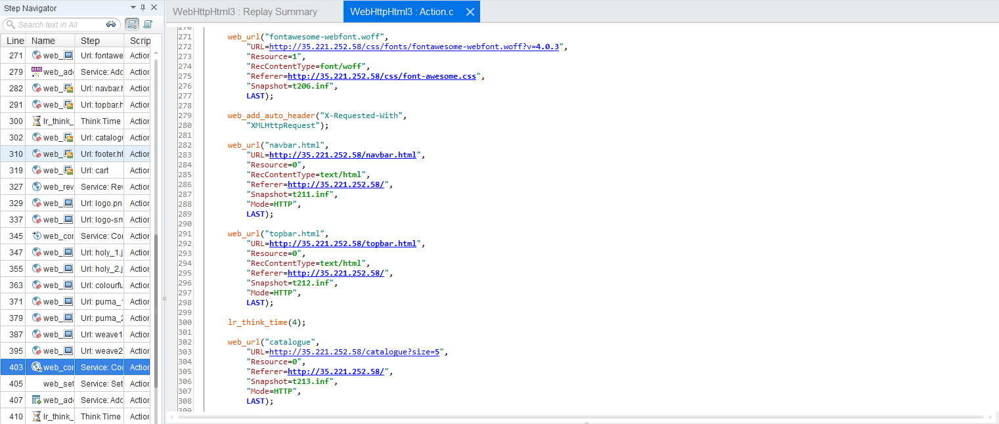

   <div align="center"><small>图1.1：录制好的脚本</small></div>
   
3. 本流程将全操作设为一个transaction，因此在前后加入`lr_start_transaction`和`lr_end_transaction`两部分脚本，给transaction起名为`login and browse`。

   （实际上在*Controller*运行的时候会自动把全文设为一个transaction，这里我自己做一个简单包装）

4. **参数化**：可以在脚本的最前端看到一个web_set_user的语句，这一部分是和登录相关的。此时，我们将用户名改为之前设计的多个用户的用户名。

   <div align="center">
   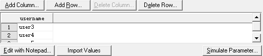
   </div>

   <div align="center"><small>图1.2：参数化</small></div>

   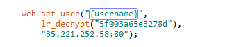

   <div align="center"><small>图1.3：参数化代码</small></div>

   到这一步，脚本基本上设置完成，尝试着去做replay操作，观察是否能够成功运行。

5. 打开*Controller*，调整并发Vuser的数量等参数，首先调整Vuser为5个：

   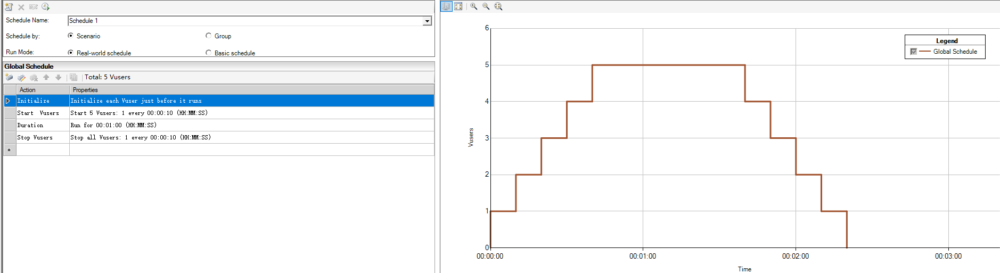

   <div align="center"><small>图1.4：Controller设置vuser数量</small></div>

6. 点击按钮开始运行，稍加等待后得到结果：

   （由于该服务器并没有跑在本地localhost，因此监控资源实际上没有太大意义）

   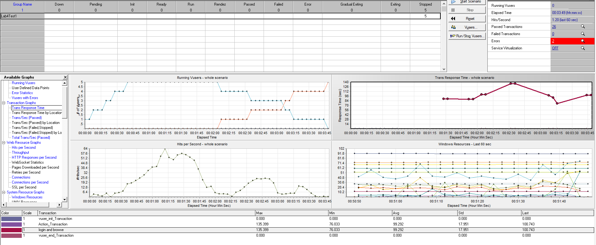

   <div align="center"><small>图1.5：Controller运行时截图</small></div>

7. 使用*Analysis*，对测试结果进行关联分析：

   （图中的规则变化曲线为Vuser的数量）

   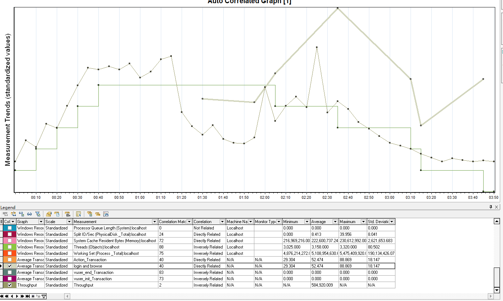

   <div align="center"><small>图1.6：Analysis生成的图片</small></div>

7. 变更Vuser的数量，回到第5步进行**重复测试**。

   

#### 1.1.2 测试结果分析

1. 当Vuser最大为5的时候：见上图
   * 随着Vuser数量的增长，Throughput先是增加，之后开始下降并发生波动。说明对于一个Transaction来说，前半部分的文件下载量要大于后半部分。这里正好说明前半部分是在加载主页
   * Transaction的响应时间成一个先增长，后下降的趋势，latency的增加说明5个Vuser已经给平台造成了一些压力。
   
2. 当Vuser最大为10的时候：

   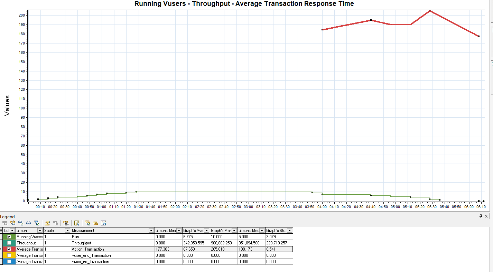

   <div align="center"><small>图1.7：Throughput - Running Vusers</small></div>
   
   * 此时可以看到，相比之前测试而言，此时的平均响应时间发生了大量的增长，而且throughput也发生了下降，说明此时平台收到的压力已经比较明显。

### 1.2 注册 + 登录

#### 1.2.1 测试详细流程

1. 使用Vuser Generator，对整个服务流程进行录制。

   * 录制一套注册、登出、再登入的流程。

   * 录制好之后可以看到生成的脚本：

   * 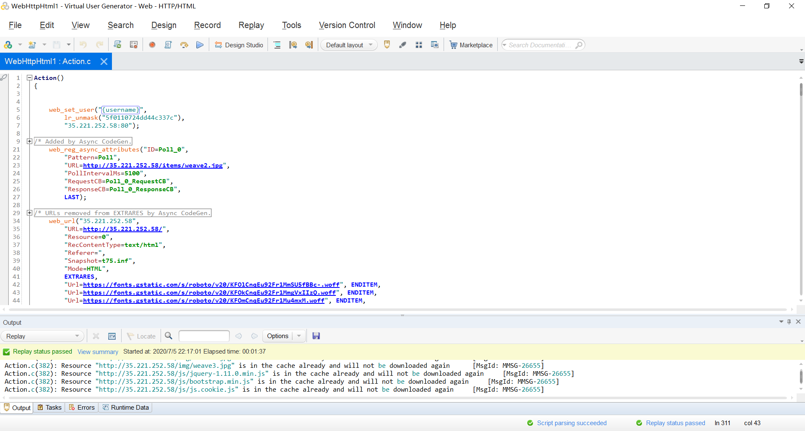

     <div align="center"><small>图2.1：脚本</small></div>

     

2. 本流程将登录和注册设为两个 transaction，如下图所示。

   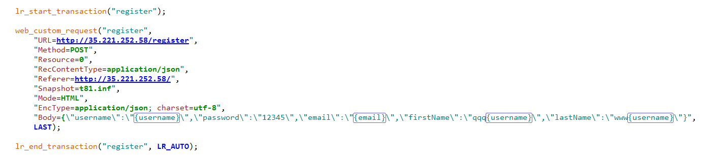
   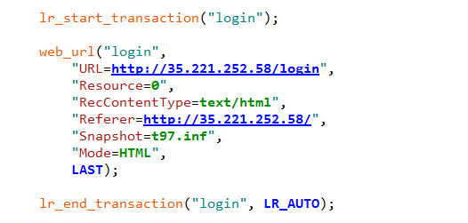

3. **参数化**：注册和登录的用户需要用不同的用户名以避免碰撞，于是需要进行参数化。将用户的邮箱和用户名参数化后，结果如上图。参数化的参数规则如下：

   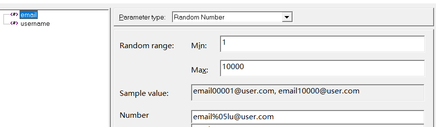
   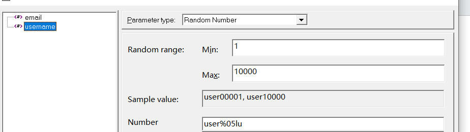

4. 打开Controller，调整Vuser为5个，开始运行，一段时间后得到结果。

5. 使用Analysis，对测试结果进行关联分析：

   （图中的绿色曲线为Vuser的数量）

   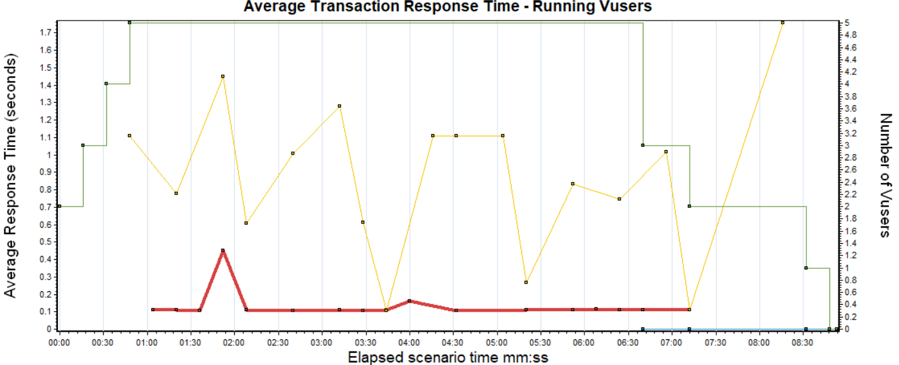

#### 1.2.2 测试结果与分析

1. 当 Vuser 数量为 5 的时候，平台的注册操作依然有巨大的抖动，但登陆操作却基本稳定，初步判断是因为平台的写操作需要较长的时间才能提交。整体测试结果基本位于预期范围内，说明平台注册和登陆操作在较小的并发请求下能够正常工作。

### 1.3 登录 + 按类别查找商品

#### 1.3.1 测试流程

1. 注册一个用户，用于后面登录。

2. 使用*Virtual user Generator*，对整个服务流程进行录制。
   
   * 登录使用先前注册好的其中一个用户
   * 因为使用Chrome录制，可能会访问google的一些相关网页，在录制的时候，需要开启代理。
   * 录制选项里面，需要调整Recording options里面，基于URL-based script，否则在replay的时候会报错无法运行。
   * 录制完成后，仅include和35.221.252.58相关的操作，exclude掉和谷歌相关的操作
   
   录制好之后可以看到生成的脚本：
   
   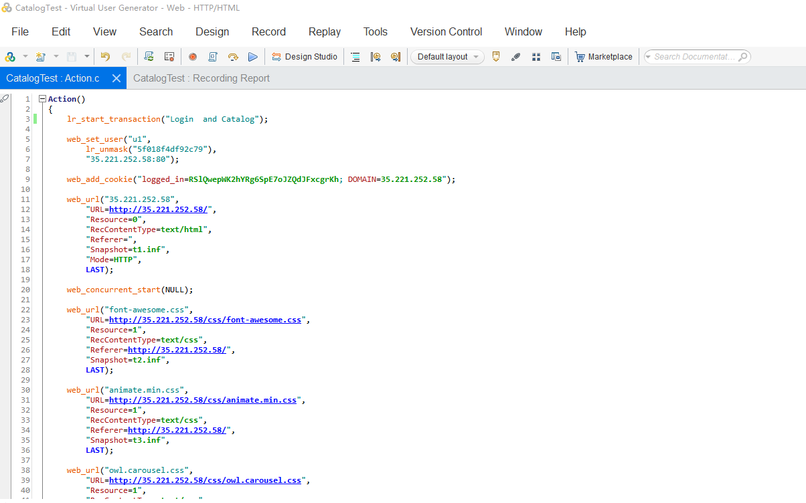

   <div align="center"><small>图3.1：脚本</small></div>
   
3. 本流程将全操作设为一个transaction，因此在前后加入`lr_start_transaction`和`lr_end_transaction`两部分脚本，给transaction起名为`Login Catalog`。

   （实际上在Controller运行的时候会自动把全文设为一个transaction，这里我自己做一个简单包装）

4. **参数化**：可以在脚本的最前端看到一个web_set_user的语句，这一部分是和登录相关的。此时，我们将用户名改为之前设计的多个用户的用户名。

   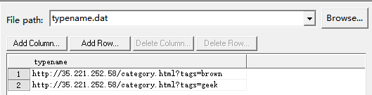

   <div align="center"><small>图3.2：类别参数化</small></div>

   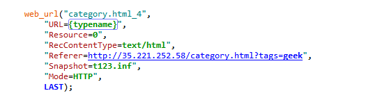

   <div align="center"><small>图3.3：参数化相关代码</small></div>

   到这一步，脚本基本上设置完成，尝试着去做replay操作，观察是否能够成功运行。

5. 打开Controller，调整并发Vuser的数量等参数，首先调整Vuser为10个：

   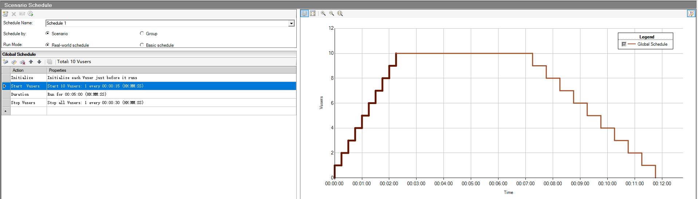

   <div align="center"><small>图3.4：vuser数量设置</small></div>

6. 点击按钮开始运行，稍加等待后得到结果：

   （由于该服务器并没有跑在本地localhost，因此监控资源实际上没有太大意义）

   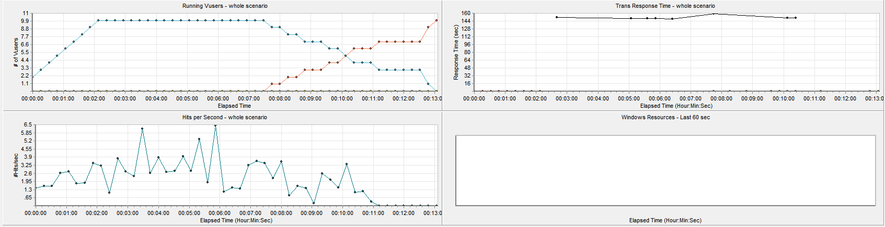

   <div align="center"><small>图3.5：Controller运行时截图</small></div>

7. 使用Analysis，对测试结果进行关联分析：

   （图中的规则变化曲线为Vuser的数量）

   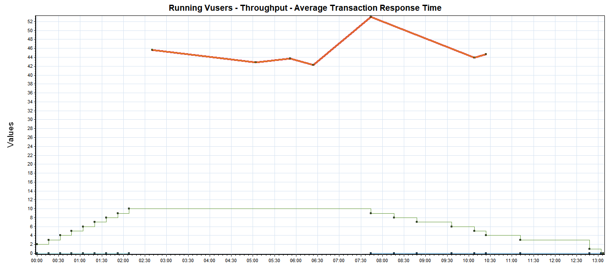

   <div align="center"><small>图3.6：Throughput - Avg.Latency - Running users</small></div>

   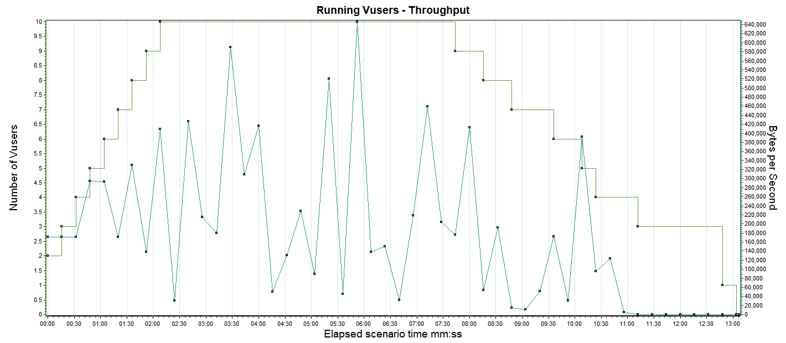

   <div align="center"><small>图3.7：Throughput - Running users</small></div>

7. 变更Vuser的数量，回到第5步进行**重复测试**。

#### 1.3.2 测试结果分析

1. 当Vuser最大为10的时候：见上图
   * 随着Vuser数量的增长，Throughput的波动越来越剧烈且总体上呈下降趋势，。说明对于一个Transaction来说，前半部分的文件下载量要大于后半部分。这里正好说明前半部分是在加载主页
   * Transaction的响应时间成一个先下降，后增长的趋势，latency的增加说明10个Vuser已经给平台造成的压力十分明显。

2. 当Vuser最大为4的时候：

   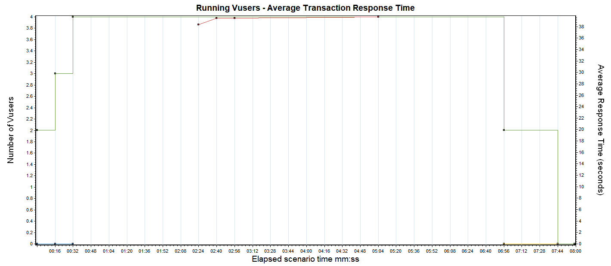

   <div align="center"><small>图3.8：Avg. Latency - Running users</small></div>

   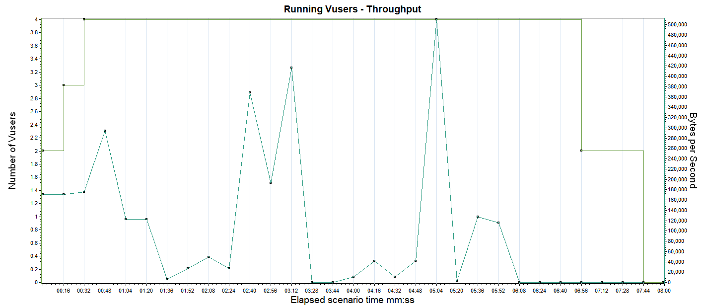
   
   <div align="center"><small>图3.9：Throughput - Throughput</small></div>
   
   * 此时可以看到，相比之前测试而言，由于并发用户数更少，此时的平均响应时间小了许多，而且throughput的抖动也更加平缓且总体上呈现比较平均的趋势，说明此时平台收到的压力比较小。

### 1.4 登录 + 加入购物车 + 下单

#### 1.4.1 测试流程

1. 首先通过 *Virtual User Generator* 的录制脚本功能录制脚本。

   1. 加载完成后，在首页点击登录。
   2. 登录成功后，点击商品，进入商品详情列表，将商品加入购物车。
   3. 加入购物车后，添加收货地址、付款方式，点击下单
   4. 成功下单后，会进入用户的订单页面，查看订单是否成功。

2. 修改 *Virtual User Generator* 生成的脚本

   1. 将 *username* 参数化，这里需要使用 *vuerid* 的参数化配置，因为如果不同的 *vuser* 使用了同一个用户登录，进行下单操作，可能会造成并发问题。

      

      <div align="center"><small>图4.1：参数化设置</small></div>

   2. 获取用户登录的 session id

      ``` c
      web_reg_save_param_ex(
      	    "ParamName=sessionId", 
      	    "LB/IC=logged_in=",
      	    "RB/IC=;",
      	    "Ordinal=1",
      	    SEARCH_FILTERS,
      	        "Scope=Cookies",
      		LAST);
      ```

   3. 添加 transaction，分别添加 tx_login、tx_

#### 1.4.2 测试结果分析


## 2. 网站的性能结果分析

### 2.1 架构

刚开始时，我们直接使用测试计划中的架构部署被测网站，在使用浏览器访问时效果不是很差，感觉不出和其它网站的响应时间的差别，这主要是因为被测网站是个私人网站，只有几个用户，没有并发。

开始测试的时候，可以看到在 测试用例1 和 测试用例3 中吞吐量测试的时候 *Vuser* 的并发都被限制在了 10 以下。在测试执行过程中，也发现了 Controller 会报大量图 2.1.1 的错误。


<div align="center"><small>图2.1.1：Timeout</small></div>

考虑到，我们原来的架构中，所有的请求都需要发送给 *frontend* ，*frontend* 既需要通过 express 返回静态资源，有需要通过 express 注册号的路由返回动态资源，压力比较大，自然也会成为性能瓶颈。

于是，我们将静态资源和动态资源进行分离。如图2.1.2所示，我们使用 nginx 作为反向代理，将请求分成静态和动态，分别转发给原先的 *frontend* 处理动态请求，静态请求则发送给另一个 nginx 服务器来专门处理静态请求。


<div align="center"><small>图2.1.2：新架构</small></div>

### 2.2 部署平台

由于我们将网站使用 *docker* 直接部署在云服务器上，没有对服务器的资源进行整合。在测试的时候，通过 *htop* 命令发现CPU、Memory 资源利用率都非常低，基本上只有 10% 左右。

不过这也正说明了，我们部署的网站的性能瓶颈不是服务器性能，而是其他方面

### 2.3 资源文件大小

我们在测试中发现，某些静态资源图片非常大，有3~4MB，经常下载的时候出现缓慢的加载、卡顿。于是，我们将静态图片无损压缩后进行再次部署测试，测试结果明显好于未压缩的情况。测试用例4 就是在 压缩之后进行的测试，可以看到，即使是 50个 vusers，也不会出现 timeout 的报错。
