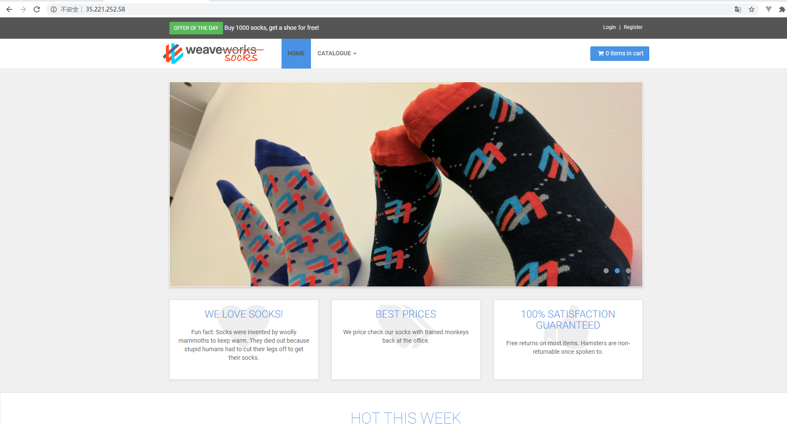

# 测试报告 
> Lab4 性能测试测试报告

## 目录

[toc]

----------------------------

## 总览

### 测试对象

我们搭建了一个电商网站的Demo，weavesocks，作为被测对象。

* 服务器：4核CPU ，15G内存，位于台湾。
* 基本架构：微服务，各服务和数据库运行在docker容器里面，前端有一个nginx做动静分离和负载均衡。
* IP地址: http://35.221.252.58/

* 网站主页：

  

### 测试方法

本次测试提取了电商网站常用的四种操作流程，作为四个transaction，分别进行测试，内容如下：

1. 登录 + 从主页浏览商品详情
2. 登录 + 从目录浏览商品详情
3. 注册 + 登录
4. 登录 + 加入商品至购物车 + 付款

每个测试的具体流程和操作详见后文。

## 1. 登录 + 从主页浏览商品详情

### 测试详细流程

1. 提前注册好多个用户，用于后面直接登录。这些用户的密码相等方便后面的参数化操作。

2. 使用Vuser Generator，对整个服务流程进行录制。
   
   * 登录使用先前注册好的其中一个用户
   * 因为使用Chrome录制，可能会访问google的一些相关网页，在录制的时候，需要开启代理。
   * 录制选项里面，需要调整Recording options里面，基于URL-based script，否则在replay的时候会报错无法运行。
   * 录制完成后，仅include和35.221.252.58相关的操作，exclude掉和谷歌相关的操作
   
   录制好之后可以看到生成的脚本：
   
   

3. 本流程将全操作设为一个transaction，因此在前后加入`lr_start_transaction`和`lr_end_transaction`两部分脚本，给transaction起名为`login and browse`。

   （实际上在Controller运行的时候会自动把全文设为一个transaction，这里我自己做一个简单包装）

4. **参数化**：可以在脚本的最前端看到一个web_set_user的语句，这一部分是和登录相关的。此时，我们将用户名改为之前设计的多个用户的用户名。

   

   

   到这一步，脚本基本上设置完成，尝试着去做replay操作，观察是否能够成功运行。

5. 打开Controller，调整并发Vuser的数量等参数，首先调整Vuser为5个：

   

5. 点击按钮开始运行，稍加等待后得到结果：

   （由于该服务器并没有跑在本地localhost，因此监控资源实际上没有太大意义）

   

6. 使用Analysis，对测试结果进行关联分析：

   （图中的规则变化曲线为Vuser的数量）

   

7. 变更Vuser的数量，回到第5步进行**重复测试**。

   

### 测试结果与分析

1. 当Vuser最大为5的时候：见上图
   * 随着Vuser数量的增长，Throughput先是增加，之后开始下降并发生波动。说明对于一个Transaction来说，前半部分的文件下载量要大于后半部分。这里正好说明前半部分是在加载主页
   * Transaction的响应时间成一个先增长，后下降的趋势，latency的增加说明5个Vuser已经给平台造成了一些压力。
   
2. 当Vuser最大为10的时候：

   

   * 此时可以看到，相比之前测试而言，此时的平均响应时间发生了大量的增长，而且throughput也发生了下降，说明此时平台收到的压力已经比较明显。

