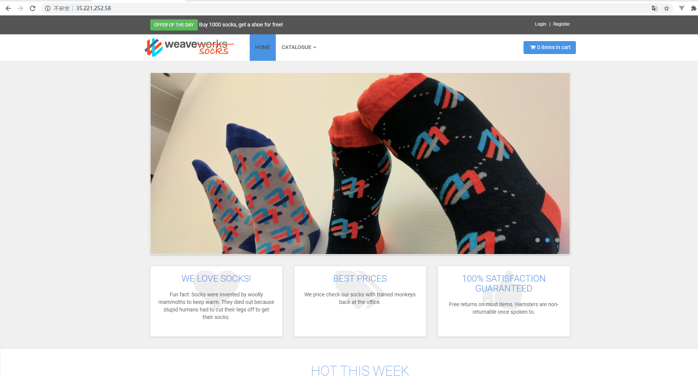

# 测试计划

## 测试对象

我们搭建了一个电商网站的Demo，weavesocks，作为被测对象。

* Web软件功能：具有电商平台的基本功能，如注册用户、登录，浏览商品，将商品加入购物车，下订单等
* 服务器：4核CPU ，15G内存，位于台湾。
* 基本架构：微服务，各服务和数据库运行在docker容器里面，前端使用Nginx做动静分离和负载均衡。
* 可能的性能瓶颈：
  * 前端需要处理大量请求，且图片较多，最有可能出现瓶颈
  * 动态资源需要访问后台数据库，可能成为瓶颈
  * 确认订单，加入购物车等操作同样涉及多个微服务模块的交互以及访问数据库，也有可能成为瓶颈。不过这部分涉及的数据量不大，成为瓶颈的可能性相对较小
* 网站主页：

 

## 测试用例

### 用例1：登录 + 主页浏览详情

* 场景：

  用户首先登录，之后从主页浏览商品详情界面。

* 用户数：

  Vuser从5逐渐增加，每次增加5，直到出现性能瓶颈。

* 性能指标：

  * Throughput 吞吐量
  * Transaction Response Time：事务的响应时间，相当于Latency

* 参数化用例：

  本测试可以以登录的用户名作为参数，在多个Vuser的情况下模拟多用户登录。

  
### 用例2：登录 + 目录浏览详情

* 场景：

  用户首先登录，之后从目录页浏览商品详情界面，并可以对浏览商品做适当筛选。

* 用户数：

  Vuser从5逐渐增加，每次增加5，直到出现性能瓶颈。

* 性能指标：

  * Throughput 吞吐量
  * Transaction Response Time：事务的响应时间，相当于Latency

* 参数化用例：

  本测试可以以浏览商品的种类作为参数，在多个Vuser的情况下模拟多用户访问目录页。